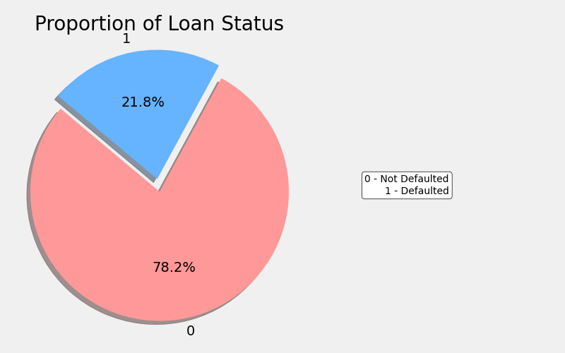
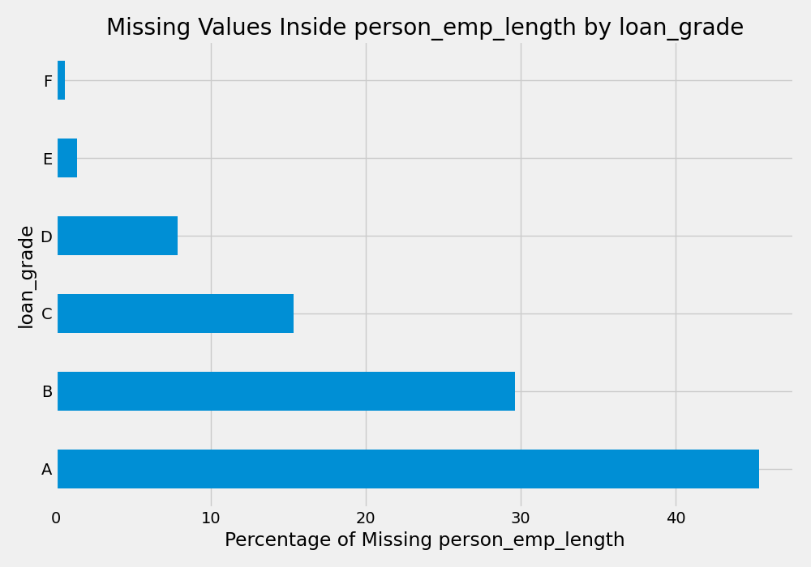
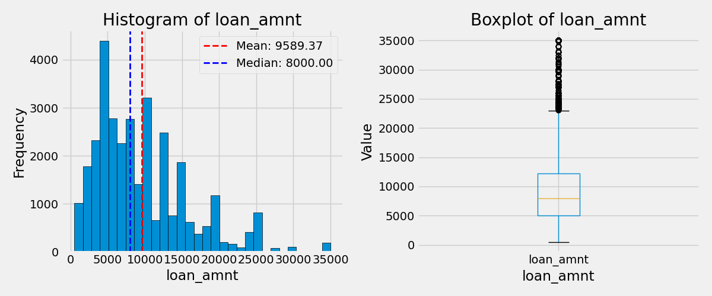
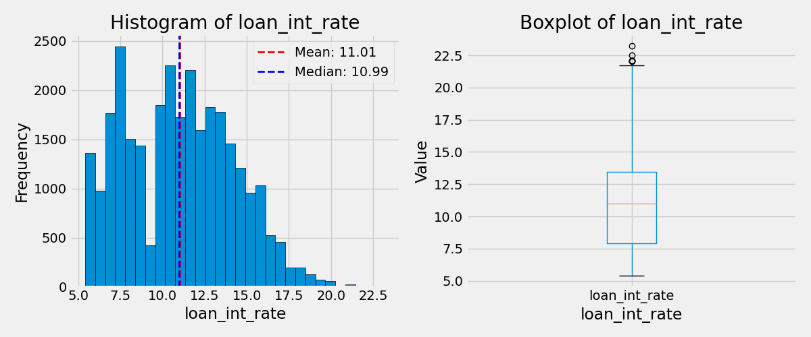
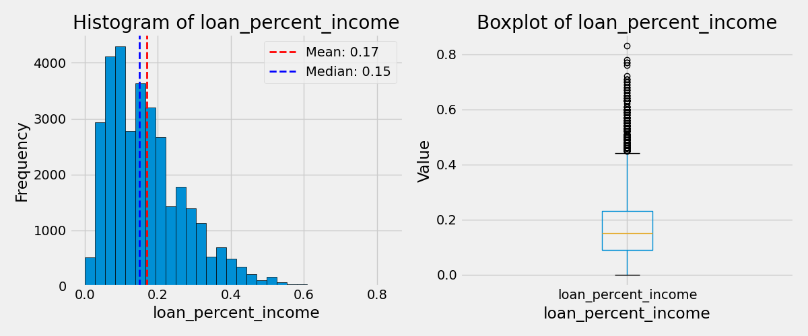
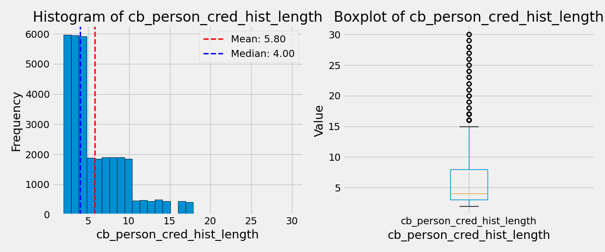
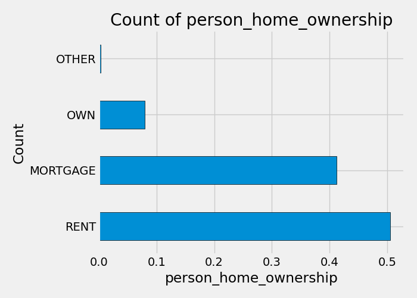
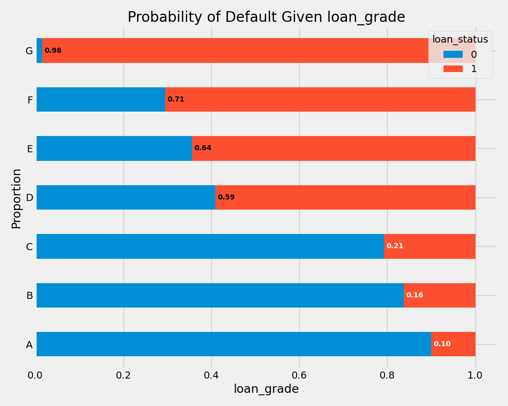
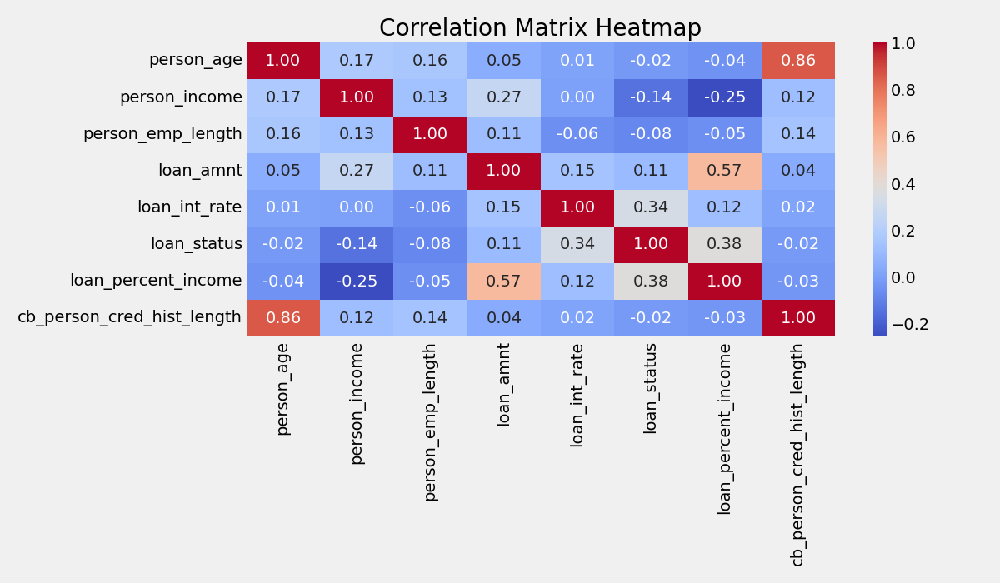
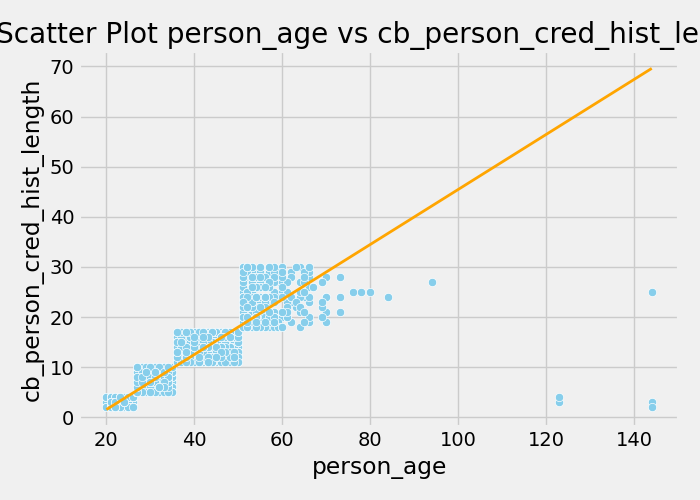

# CreditScorer: An Intelligent Credit Scoring Model 


## Background
A leading Bank XYZ wants to improve its loan approval process. Currently, this process is done manually, which is slow and inconsistent. The bank wants to automate credit scoring to speed up approvals and reduce errors while managing the risk of loan defaults. To solve this, the bank plans to use automated credit scoring, which leverage machine learning model to make better decisions.

The main goal of this project is to create a credit scorecard model that is able to calculate the credit score of applicants. This will help the bank:

1. Automate Loan Approvals: Make the process faster and more efficient.
2. Manage Risk Better: Accurately identify high-risk applicants to minimize defaults.
3. Standardize Decisions: Ensure consistent and objective loan approvals.
4. Grow the Business: Approve more loans to creditworthy customers.## Project Scope
For this project, the project scope will be:
1. Data: 
    Utilize Credit Bureau Data sourced from Kaggle. This dataset contains comprehensive information on loan applicants, including their credit history, demographic details, and financial behavior.
2. Product:
    - Credit Scorecard Model: Logistic Regression Model trained using a Weight of Evidence.
    - Credit Scorecard: Create a scoring system derived from the model, which translates the predictive output into a standardized credit score. The calculation is done using the "points to double odds" method.
## Tools and Python Packages
## Tools 
1. Code Editor: Visual Studio Code
2. Python Version: 3.10.13

### Python Packages 
1. Data Manipulation Packages used for handling and importing dataset such as `pandas` and `numpy`.
2. Data Visualization: Packages used for data visualization such as `matplotlib` and `seaborn`. 
3. Data Preprocessing: Packages used for binning process such as `optbinning`.  
4. Scorecard Modelling: Packages that were used to create a credit scorecard and a credit scorecard model model such as `scikit-learn`, and `optbinning`.
5. Model Evaluation: Packages that were used to evaluate model such as `scikit-learn`.
## Installation and Setup
For running the application locally, you can just use `anaconda` or `venv` but make sure the python version is 3.10.13. Then, install the the specified libraries inside `requirements.txt` 
```bash
  cd CreditScorer
  pip install -r requirements.txt
```
## About the Data
|      **Feature Name**      |               **Description**               |
|:--------------------------:|:-------------------------------------------:|
| person_age                 | Age                                         |
| person_income              | Annual Income                               |
| person_home_ownership      | Home ownership                              |
| person_emp_length          | Employment length (in years)                |
| loan_intent                | Loan intent                                 |
| loan_grade                 | Loan grade                                  |
| loan_amnt                  | Loan amount                                 |
| loan_int_rate              | Interest rate                               |
| loan_status                | Loan status (0 is non default 1 is default) |
| loan_percent_income        | Percent income                              |
| cb_person_default_on_file  | Historical default                          |
| cb_preson_cred_hist_length | Credit history length                       |

## Exploratory Data Analysis
### How is the proportion of the response variable?

The response variable is unbalanced, with Good Customers (0) making up approximately **78.2%** and Bad Customers (1) making up about **21.8%**. This imbalance is common in the credit industry, as most users are not expected to default.


### Are there missing values inside the predictor variables?
There are missing values in the `person_emp_length` and `loan_int_rate` explanatory variables.


Missing values in `person_emp_length` may indicate unemployment or self-employment. To address this, they are filled with 0 values. Further analysis revealed that most applicants with missing `person_emp_length` have high loan_grade, with approximately 75% falling into grades A and B. This suggests they could be either business owners or unemployed with alternative income sources.


Missing values in `loan_int_rate` may result from human or system errors. Further investigation is needed to determine the cause. Perform mean or median imputation will be suffice.

**In this project using Weight of Evidence method it already handles missing data**.

### How is the distribution for the numerical predictor variable? Are there any outliers or anomalies?

**Positive outliers are observed in all predictor variables, resulting in right-skewed distributions. Some of these outliers are explainable**:
1. `person_income`: High net worth individuals (HNWIs) contribute to the skewness in income distributions.

2. `loan_amnt`: Borrowers with higher incomes may seek larger loan amounts.

3. `loan_int_rate`: Higher loan interest rates may apply to customers perceived as high-risk.

4. `loan_percent_income`: Some borrowers may request loans closer to their income percentage, potentially due to emergencies.

5. `cb_person_cred_hist_length`: Some individuals have exceptionally long credit histories.


**Anomalies in the data include**:
1. `person_age`: While the oldest recorded individuals lived to 122 years, some entries in the dataset exceed this limit. To address this, records with `person_age` above 122 are removed, as they represent only a small fraction of the dataset (5 records).
```python
df[df["person_age"] > 122]
```
|       | **person_age** | person_income | person_home_ownership | person_emp_length | loan_intent | loan_grade | loan_amnt | loan_int_rate | loan_status | loan_percent_income | cb_person_default_on_file | cb_person_cred_hist_length |
|-------|------------|---------------|-----------------------|-------------------|-------------|------------|-----------|---------------|-------------|---------------------|---------------------------|----------------------------|
| 81    | **144**        | 250000        | RENT                  | 4.0               | VENTURE     | C          | 4800      | 13.57         | 0           | 0.02                | N                         | 3                          |
| 183   | **144**        | 200000        | MORTGAGE              | 4.0               | EDUCATION   | B          | 6000      | 11.86         | 0           | 0.03                | N                         | 2                          |
| 575   | **123**        | 80004         | RENT                  | 2.0               | EDUCATION   | B          | 20400     | 10.25         | 0           | 0.25                | N                         | 3                          |
| 747   | **123**        | 78000         | RENT                  | 7.0               | VENTURE     | B          | 20000     | NaN           | 0           | 0.26                | N                         | 4                          |
| 32297 | **144**        | 6000000       | MORTGAGE              | 12.0              | PERSONAL    | C          | 5000      | 12.73         | 0           | 0.00                | N                         | 25                         |

2. `person_emp_length`: It's impossible for loan applicants aged 21 and 22 to have worked for 123 years. To rectify this, replace these outlier values with the common employment duration for their age range.
```python
df[df["person_emp_length"] > df["person_age"]]
```
|     | person_age | person_income | person_home_ownership | person_emp_length | loan_intent | loan_grade | loan_amnt | loan_int_rate | loan_status | loan_percent_income | cb_person_default_on_file | cb_person_cred_hist_length |
|----:|-----------:|--------------:|----------------------:|------------------:|------------:|-----------:|----------:|--------------:|------------:|--------------------:|--------------------------:|---------------------------:|
|   0 |         22 |         59000 |                  RENT |             123.0 |    PERSONAL |          D |     35000 |         16.02 |           1 |                0.59 |                         Y |                          3 |
| 210 |         21 |        192000 |              MORTGAGE |             123.0 |     VENTURE |          A |     20000 |          6.54 |           0 |                0.10 |                         N |                          4 |

### How is the occurence of categorical predictor variable?
The occurences of:
1. `person_home_ownership` around 90% of loan applications still don't own a property or home where 50% of them is still renting and 40% of them still on mortgage.

2. `loan_intent` are almost distributed evenly around each category.

3. `loan_grade` around 65% of the loan applicants has a good loan grade, A and B.

4. `cb_person_default_on_file` almost 20% of the customers had history of credit default. 


### What is the distribution of the numerical predictor variable across different classes of the response target variable?
Distributions of `loan_int_rate` and `loan_percent_income` vary based on the response variable, suggesting that higher values of these features correlate with a higher likelihood of default.


### Do certain categories of the categorical predictor variable have higher or lower probabilities of a specific class in the response variable?
1. `person_home_ownership`: The probability of default is highest among those who still **rent** (32%) and those with **other types** of home ownership (31%).

2. `loan_intent`: The probability of loan default is highest among those who took out loans for **debt consolidation** (29%), followed by **medical needs** (27%), **home improvement** (26%), **personal loans** (20%), **education loans** (17%), and **ventures** (15%).

3. `loan_grade`: The probability of loan default is higher for those who has grade **G** (98%), **F** (71%), **E** (64%), and **D** (59%).

4. `cb_person_default_on_file`: The probability of loan default is higher for those who has history of default (38%).


### How is the correlation amongst numerical predictor variable? (Multicollinearity)

There are multicollinearity amongst numerical predictor variable, such as: `person_age` vs `cb_person_cred_hist_length` and `loan_amnt` vs `loan_percent_income`.



## Data Preprocessing
The whole process of data processing involve 4 steps: 
1. Data splitting
2. Weight of Evidence and Information Value
3. Feature Selection 
4. Data Transformation (Mapping predictors value with the Weight of Evidence values). 

### Data Splitting
Split dataset into training set (70%) and test set (30%).

### Weight of Evidence (WoE) and Information Value (IV)
The order of this steps are perform binning for each predictors, calculate weight of evidence, and calculate the information value.

#### Binning
Binning is an operation used to convert continuous numerical data into a discrete/ categorical data. The original data values are divided into small intervals known as bins, and it is act as a bucket where multiple original values can be in the same interval/ bucket. Binning is not limited to numerical data in this context, the same process can be done on the categorical data values. Binning process for Weight of Evidence requires at least 5% of data are contained inside each bin.

#### Weight of Evidence 
WoE measures how good each grouped bins (inside a predictor variable) in predicting the desired value of the binary response variable (binary classification). The formula for calculating WoE is

$$ \text{WoE} = \ln \left( \frac{\text{Proportion of Good}}{\text{Proportion of Bad}} \right) $$

Where:
- $ \text{Proportion of Good} $ is the proportion of customers who paid back (**Good Customers**).
- $ \text{Proportion of Bad}\ $ is the proportion of default customers (**Bad Customers**).
- $ \text{ln} $ denotes the natural logarithm.

Example results of calculting the Weight of Evidence is shown below (using `optbinning`)

|        |                  Bin | Count | Count (%) | Non-event | Event | Event rate |       **WoE** |       IV |       JS |
|-------:|---------------------:|------:|----------:|----------:|------:|-----------:|----------:|---------:|---------:|
|      0 |     (-inf, 22840.00) |  1142 |  0.050075 |       414 |   728 |   0.637478 | -1.840948 | 0.226646 | 0.024905 |
|      1 | [22840.00, 34990.00) |  3182 |  0.139525 |      1959 |  1223 |   0.384349 | -0.805386 | 0.109504 | 0.013330 |
|      2 | [34990.00, 39930.00) |  1636 |  0.071736 |      1195 |   441 |   0.269560 | -0.279657 | 0.006048 | 0.000753 |
|      3 | [39930.00, 59982.00) |  6349 |  0.278392 |      5000 |  1349 |   0.212474 |  0.033561 | 0.000311 | 0.000039 |
|      4 | [59982.00, 79942.50) |  4805 |  0.210690 |      4086 |   719 |   0.149636 |  0.460947 | 0.039009 | 0.004833 |
|      5 | [79942.50, 89325.00) |  1405 |  0.061607 |      1256 |   149 |   0.106050 |  0.855228 | 0.034628 | 0.004201 |
|      6 |      [89325.00, inf) |  4287 |  0.187977 |      3921 |   366 |   0.085374 |  1.094956 | 0.160225 | 0.019084 |
|      7 |              Special |     0 |  0.000000 |         0 |     0 |   0.000000 |       0.0 | 0.000000 | 0.000000 |
|      8 |              Missing |     0 |  0.000000 |         0 |     0 |   0.000000 |       0.0 | 0.000000 | 0.000000 |
| Totals |                      | 22806 |  1.000000 |     17831 |  4975 |   0.218144 |           | 0.576370 | 0.067146 |


This plot shows that the higher the person income the higher the WoE that proves that the person is a Good Customer.

When we plot the WoE values, we want to look for monotonicity, which means the WoE values should either gradually increase or decrease.

**Why is Monotonicity Important?**

Monotonicity indicates a consistent, predictable relationship between the predictor variable and the response variable. This is particularly important for the following reasons:

1. Model Stability: Monotonic relationships lead to more stable and reliable models. Non-monotonic relationships can introduce noise and reduce the model's ability to generalize well to unseen data.
2. Interpretability: Monotonic WoE values make the model more interpretable. It is easier to explain that as the value of a certain variable increases, the risk of default increases (or decreases), which is intuitive for stakeholders.
3. Logistic Regression Compatibility: Logistic regression assumes a linear relationship between the independent variables and the log-odds of the dependent variable. Monotonic WoE values help to satisfy this assumption, as they reflect a more straightforward relationship that logistic regression can capture effectively.

#### Information Value
IV is used to measure the predictive power of the feature on the value of the specified binary response variable (0 or 1). The formula for calculating the IV is
$$ \text{WoE} = \sum (\text{Proportion of Good} - \text{Proportion of Bad}) * \text{WoE} $$
Here is the table shows the interpretation of each IV.
| Information Value | Predictive Power                        |
|-------------------|-----------------------------------------|
| < 0.02            | Useless in modelling                    |
| 0.02 - 0.1        | Weak predictor                          |
| 0.1 - 0.3         | Medium predictor                        |
| 0.3 - 0.5         | Strong predictor                        |
| > 0.5             | Suspiciously good. Check further        |


Here is the result of the IV
|    |             Characteristic |       IV |         Interpretation |
|---:|---------------------------:|---------:|-----------------------:|
|  8 |        loan_percent_income | 0.953721 | Very Strong Predictive |
|  5 |                 loan_grade | 0.834618 | Very Strong Predictive |
|  7 |              loan_int_rate | 0.670894 | Very Strong Predictive |
|  1 |              person_income | 0.576370 | Very Strong Predictive |
|  2 |      person_home_ownership | 0.386377 |      Strong Predictive |
|  9 |  cb_person_default_on_file | 0.159914 |      Medium Predictive |
|  6 |                  loan_amnt | 0.095098 |        Weak Predictive |
|  4 |                loan_intent | 0.088282 |        Weak Predictive |
|  3 |          person_emp_length | 0.066238 |        Weak Predictive |
|  0 |                 person_age | 0.010358 |         Not Predictive |
| 10 | cb_person_cred_hist_length | 0.005744 |         Not Predictive |

### Feature Selection
For feature selection we will be selecting characteristic with the IV above 0.02. So based on the information value displayed in previous table. The features that will be used are:
1. loan_percent_income
2. loan_grade
3. loan_int_rate
4. person_income
5. person_home_ownership
6. cb_person_default_on_file
7. loan_amnt
8. loan_intent
9. person_emp_length

### WoE Transformation
After calculating WoE, we will be need to transform the original data values of each predictor into a Weight of Evidence values based on what bin that those original values belong to.


## Modelling

### Data Splitting
Split datataset into training set (70%) and testing set (30%). 

### Data Preprocessing
1. Binning Process
2. Calculate Weight of Evidence (WoE)
3. Map WoE into the training and testing dataset


Project Organization
------------

    ├── LICENSE
    ├── Makefile           <- Makefile with commands like `make data` or `make train`
    ├── README.md          <- The top-level README for developers using this project.
    ├── data
    │   ├── external       <- Data from third party sources.
    │   ├── interim        <- Intermediate data that has been transformed.
    │   ├── processed      <- The final, canonical data sets for modeling.
    │   └── raw            <- The original, immutable data dump.
    │
    ├── docs               <- A default Sphinx project; see sphinx-doc.org for details
    │
    ├── models             <- Trained and serialized models, model predictions, or model summaries
    │
    ├── notebooks          <- Jupyter notebooks. Naming convention is a number (for ordering),
    │                         the creator's initials, and a short `-` delimited description, e.g.
    │                         `1.0-jqp-initial-data-exploration`.
    │
    ├── references         <- Data dictionaries, manuals, and all other explanatory materials.
    │
    ├── reports            <- Generated analysis as HTML, PDF, LaTeX, etc.
    │   └── figures        <- Generated graphics and figures to be used in reporting
    │
    ├── requirements.txt   <- The requirements file for reproducing the analysis environment, e.g.
    │                         generated with `pip freeze > requirements.txt`
    │
    ├── setup.py           <- makes project pip installable (pip install -e .) so src can be imported
    ├── src                <- Source code for use in this project.
    │   ├── __init__.py    <- Makes src a Python module
    │   │
    │   ├── data           <- Scripts to download or generate data
    │   │   └── make_dataset.py
    │   │
    │   ├── features       <- Scripts to turn raw data into features for modeling
    │   │   └── build_features.py
    │   │
    │   ├── models         <- Scripts to train models and then use trained models to make
    │   │   │                 predictions
    │   │   ├── predict_model.py
    │   │   └── train_model.py
    │   │
    │   └── visualization  <- Scripts to create exploratory and results oriented visualizations
    │       └── visualize.py
    │
    └── tox.ini            <- tox file with settings for running tox; see tox.readthedocs.io


--------

<p><small>Project based on the <a target="_blank" href="https://drivendata.github.io/cookiecutter-data-science/">cookiecutter data science project template</a>. #cookiecutterdatascience</small></p>
